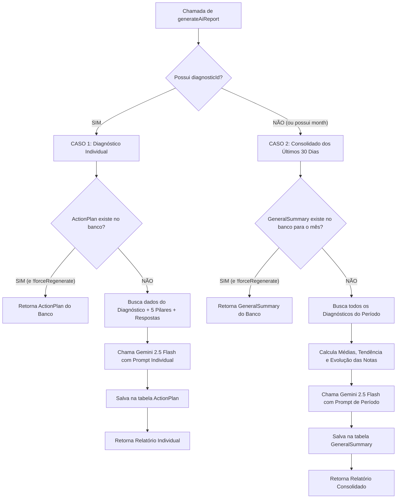

# 🤖 Documentação do Módulo: Relatório com IA (`iareport.md`)

Este documento explica de forma clara e técnica o funcionamento completo do módulo de relatórios com Inteligência Artificial (**Google Gemini**) do **Eco-Diagnóstico**, incluindo o componente visual, os parâmetros, as funções backend, a lógica de distinção entre casos e a persistência no banco de dados.

---

## 📌 1. Visão Geral

O sistema utiliza a estratégia **Cache-First (Database-First)** para geração e exibição de relatórios com IA. 

### Benefícios dessa abordagem:
1. **Economia de Tokens:** Não faz chamadas repetidas à API da IA para diagnósticos ou períodos que já foram calculados.
2. **Velocidade:** Carregamento instantâneo do banco de dados (0ms de latência de IA) em consultas subsequentes.
3. **Histórico e Auditoria:** Os relatórios ficam salvos no banco de dados e vinculados à instituição e ao diagnóstico.

---

## 🔀 2. Como o Sistema Sabe: Caso 1 vs. Caso 2?

A Server Action [`generateAiReport`](file:///C:/xampp/htdocs/eco-diagnostico/app/%28dashboard%29/_actions/generate-ai-report.ts/index.ts) recebe o payload validado pelo Zod e utiliza a presença do **`diagnosticId`** como discriminador de fluxo:



### Resumo da Regra de Decisão:
* **Caso 1 (Individual):** Quando `diagnosticId` é fornecido (ex: na página `/resultados/[id]`), o foco é avaliar **aquele diagnóstico único**, comparando as notas dos 5 pilares (`Energia`, `Água`, `Resíduos`, `Materiais`, `Gestão`) e salvando na tabela **`ActionPlan`**.
* **Caso 2 (Consolidado 30 Dias):** Quando `diagnosticId` **não** é fornecido e/ou `month` é informado (ex: na página `/evolucao`), o foco é avaliar a **trajetória de múltiplos diagnósticos**, calculando a evolução da nota no tempo e salvando na tabela **`GeneralSummary`**.

---

## 🔘 3. O Componente `<AiReportButton />`

Localização: [`app/_components/ai-report.button.tsx`](file:///C:/xampp/htdocs/eco-diagnostico/app/_components/ai-report.button.tsx)

É um **Client Component (`"use client"`)** que renderiza o botão de disparo e encapsula o modal `Dialog` com suporte a Markdown.

### 📋 Parâmetros / Props do Botão

| Prop | Tipo | Obrigatório? | Descrição |
| :--- | :--- | :---: | :--- |
| `diagnosticId` | `string` | Opcional | ID do diagnóstico específico (ativa o **Caso 1**). |
| `month` | `string` | Opcional | Mês em formato `"MM"` (ex: `"08"`) para consolidado dos 30 dias (ativa o **Caso 2**). |
| `initialPlan` | `object` | Opcional | Dados já pré-carregados do banco (`content`, `summary`). Se fornecido, o botão já abre com o texto sem precisar carregar. |
| `buttonLabel` | `string` | Opcional | Texto customizado no botão. Se omitido, adota texto inteligente padrão. |
| `dialogTitle` | `string` | Opcional | Título do cabeçalho do Modal. |
| `dialogDescription`| `string` | Opcional | Subtítulo explicativo no Modal. |
| `className` | `string` | Opcional | Classes Tailwind adicionais para estilização. |

---

## ⚙️ 4. As Funções e Server Actions

Localização: [`app/(dashboard)/_actions/generate-ai-report.ts/index.ts`](file:///C:/xampp/htdocs/eco-diagnostico/app/%28dashboard%29/_actions/generate-ai-report.ts/index.ts)

### 1. `generateAiReport(input: GenerateAiReportSchema)`
Função principal executada no servidor (`"use server"`).
* **Entrada (`schema.ts`):**
  ```typescript
  {
    diagnosticId?: string;
    month?: string;
    forceRegenerate?: boolean;
    type?: "diagnostic" | "monthly";
  }
  ```
* **Retorno (`AiReportResponse`):**
  ```typescript
  {
    content: string;    // Texto Markdown gerado ou retornado do banco
    summary?: string;   // Síntese executiva
    fromCache: boolean; // true = veio do banco | false = gerado agora na IA
    createdAt?: Date;   // Data de geração/gravação
  }
  ```

### 2. `getActionPlanAction(diagnosticId: string)`
Função utilitária para verificar se um diagnóstico já possui plano salvo no banco, sem acionar a IA.

---

## 🗄️ 5. Modelagem no Banco de Dados (`schema.prisma`)

### Modelo `ActionPlan` (Caso 1 - 1 para 1 com `Diagnostic`)
```prisma
model ActionPlan {
  id            String     @id @default(cuid())
  diagnosticId  String     @unique
  diagnostic    Diagnostic @relation(fields: [diagnosticId], references: [id], onDelete: Cascade)
  content       String     @db.Text // Markdown completo da IA
  summary       String?    @db.Text // Resumo executivo
  promptContext String?    @db.Text // Metadados enviados
  aiModel       String?    @default("gemini-2.5-flash")
  createdAt     DateTime   @default(now())
  updatedAt     DateTime   @updatedAt
}
```

### Modelo `GeneralSummary` (Caso 2 - 1 para N com `Institution`)
```prisma
model GeneralSummary {
  id               String      @id @default(cuid())
  institutionId    String
  institution      Institution @relation(fields: [institutionId], references: [id], onDelete: Cascade)
  content          String      @db.Text // Análise de 30 dias em Markdown
  summary          String?     @db.Text // Síntese
  periodStart      DateTime    // Início do intervalo (ex: dia 01)
  periodEnd        DateTime    // Fim do intervalo
  averageScore     Float       // Média das notas no período
  diagnosticsCount Int         // Quantidade de diagnósticos analisados
  aiModel          String?     @default("gemini-2.5-flash")
  createdAt        DateTime    @default(now())
  updatedAt        DateTime    @updatedAt
}
```

---

## 💻 6. Exemplos Práticos de Uso

### Exemplo 1: Página de Resultados do Diagnóstico (`/resultados/[id]`)
> **Caso 1:** Analisa as respostas e os 5 pilares do diagnóstico atual.

```tsx
import AiReportButton from "@/app/_components/ai-report.button";
import { prisma } from "@/app/_lib/prisma";

const PageSlugResult = async ({ params }: { params: Promise<{ id: string }> }) => {
  const { id } = await params;

  // Busca o diagnóstico incluindo o actionPlan se já existir
  const diagnostic = await prisma.diagnostic.findUnique({
    where: { id },
    include: {
      institution: true,
      pillarScores: true,
      actionPlan: true, // <--- Cache do banco
    },
  });

  return (
    <div>
      {/* Botão de relatório individual */}
      <AiReportButton
        diagnosticId={id}
        initialPlan={diagnostic.actionPlan}
      />
    </div>
  );
};
```

---

### Exemplo 2: Página de Evolução (`/evolucao`)
> **Caso 2:** Analisa a trajetória consolidada de todos os diagnósticos dos últimos 30 dias.

```tsx
import AiReportButton from "@/app/_components/ai-report.button";
import { prisma } from "@/app/_lib/prisma";

const PageEvolucao = async () => {
  const currentMonth = String(new Date().getMonth() + 1).padStart(2, "0");

  const institution = await prisma.institution.findFirst();
  
  // Busca o último resumo geral salvo no banco
  const latestSummary = institution
    ? await prisma.generalSummary.findFirst({
        where: { institutionId: institution.id },
        orderBy: { createdAt: "desc" },
      })
    : null;

  return (
    <div>
      {/* Botão de relatório consolidado dos 30 dias */}
      <AiReportButton
        month={currentMonth}
        initialPlan={latestSummary}
        buttonLabel="Análise dos 30 Dias (IA)"
        dialogTitle="Relatório de Evolução dos Últimos 30 Dias"
        dialogDescription="Análise estratégica consolidada da trajetória de sustentabilidade da instituição."
      />
    </div>
  );
};
```

---

## 📝 7. Estrutura Padrão das Respostas da IA

Tanto no Caso 1 quanto no Caso 2, a IA é instruída a devolver **obrigatoriamente 3 seções estruturadas em Markdown**:

1. **`# 📋 Descrição do Diagnóstico / Panorama Geral`**
   * Contextualização executiva profunda baseada na pontuação obtida e no nível de maturidade da instituição.
2. **`# ⚠️ Pontos de Atenção`**
   * Destaque para os pilares mais críticos (notas baixas), gargalos operacionais e riscos de inação.
3. **`# 🎯 Plano Estratégico de Ação`**
   * Metas práticas divididas em:
     * **Curto Prazo (0 a 3 meses):** Ações imediatas (quick wins) e baixo custo.
     * **Médio Prazo (3 a 6 meses):** Ajustes de processos e capacitação.
     * **Longo Prazo (6 a 12 meses):** Investimentos e certificações estruturais.
