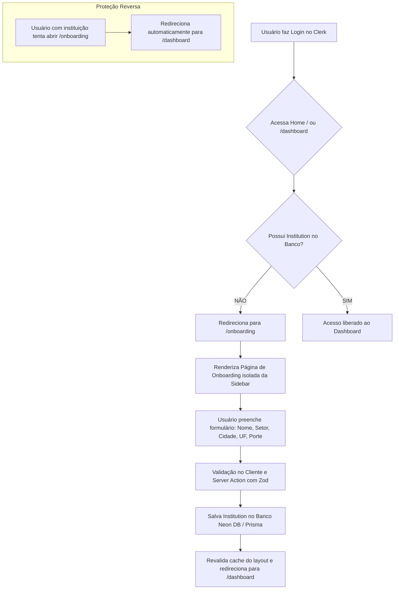

# 🏢 Documentação do Módulo: Onboarding e Primeiro Login (`onboarding.md`)

Este documento descreve detalhadamente a arquitetura, fluxo de execução, validações e boas práticas do módulo de **Controle de Primeiro Acesso e Cadastro de Instituição** no **Eco Diagnóstico**.

---

## 📌 1. Visão Geral e Objetivo

Quando um novo usuário se autentica na plataforma via **Clerk**, ele ainda não possui dados institucionais registrados (nome da organização, setor, cidade, estado e porte).

O módulo de **Onboarding** garante que:
1. **Nenhum usuário acesse o painel sem organização vinculada:** O layout intercepta a navegação e redireciona para a configuração inicial.
2. **Dados consistentes:** Todas as respostas dos diagnósticos ambientais, relatórios gerados por IA e gráficos de evolução ficam devidamente atrelados à instituição do usuário.
3. **Experiência sem atrito (UX fluida):** Formulário interativo construído com **shadcn UI**, validações declarativas com **Zod**, feedback em tempo real via **Sonner (Toasts)** e estados de carregamento.

---

## 🔄 2. Fluxo Completo de Navegação (Arquitetura)



---

## 📂 3. Estrutura de Arquivos e Responsabilidades

A implementação segue estritamente a separação de camadas do **Next.js App Router**:

| Arquivo | Tipo | Função |
| :--- | :---: | :--- |
| [`app/(dashboard)/layout.tsx`](file:///C:/xampp/htdocs/eco-diagnostico/app/(dashboard)/layout.tsx) | Server Component | **Guardião do Painel:** Intercepta qualquer rota dentro de `(dashboard)` e redireciona para `/onboarding` se o usuário não tiver instituição. |
| [`app/onboarding/page.tsx`](file:///C:/xampp/htdocs/eco-diagnostico/app/onboarding/page.tsx) | Server Component | **Página de Primeiro Acesso:** Autentica a sessão, impede acesso indevido se já cadastrado e renderiza o layout sem sidebar. |
| [`app/onboarding/_components/onboarding-form.tsx`](file:///C:/xampp/htdocs/eco-diagnostico/app/onboarding/_components/onboarding-form.tsx) | Client Component (`"use client"`) | **Interface do Formulário:** Gerencia estados locais, seleção visual de porte, tags rápidas de setor e chamadas à Server Action. |
| [`app/_actions/institution-schema.ts`](file:///C:/xampp/htdocs/eco-diagnostico/app/_actions/institution-schema.ts) | Módulo TypeScript/Zod | **Esquema de Validação:** Regras de validação do Zod e tipos TypeScript compartilhados entre cliente e servidor. |
| [`app/_actions/institution-actions.ts`](file:///C:/xampp/htdocs/eco-diagnostico/app/_actions/institution-actions.ts) | Server Actions (`"use server"`) | **Persistência no Banco:** Executa `prisma.institution.create` ou `update` no Neon DB com revalidação de rota. |
| [`app/page.tsx`](file:///C:/xampp/htdocs/eco-diagnostico/app/page.tsx) | Server Component | **Redirecionamento Inteligente da Home:** Usuários logados são despachados diretamente para `/dashboard` ou `/onboarding`. |

---

## 🛡️ 4. Validação com Zod (`institution-schema.ts`)

Para garantir integridade dos dados antes da persistência, o Zod valida tanto os tipos quanto as restrições de negócio:

```typescript
// app/_actions/institution-schema.ts
import { InstitutionSize } from "@prisma/client";
import { z } from "zod";

export const institutionFormSchema = z.object({
  name: z
    .string()
    .min(2, "O nome da instituição deve ter pelo menos 2 caracteres.")
    .max(120, "O nome não pode ultrapassar 120 caracteres."),
  sector: z
    .string()
    .min(2, "Informe o ramo ou setor de atuação da instituição.")
    .max(80, "O setor não pode ultrapassar 80 caracteres."),
  city: z
    .string()
    .min(2, "Informe a cidade sede.")
    .max(80, "A cidade não pode ultrapassar 80 caracteres."),
  state: z
    .string()
    .min(2, "Informe a sigla do estado (UF).")
    .max(2, "A sigla do estado deve ter exatamente 2 letras."),
  size: z.nativeEnum(InstitutionSize, {
    message: "Selecione o porte da instituição.",
  }),
  description: z
    .string()
    .max(500, "A descrição não pode ultrapassar 500 caracteres.")
    .optional()
    .or(z.literal("")),
});

export type InstitutionFormData = z.infer<typeof institutionFormSchema>;
```

### Categorias de Porte Suportadas (`InstitutionSize`):
* 🏪 **`MICRO`**: Microempresa (até 9 colaboradores)
* 👥 **`PEQUENA`**: Pequeno Porte (10 a 49 colaboradores)
* 🏢 **`MEDIA`**: Médio Porte (50 a 99 colaboradores)
* 🏭 **`GRANDE`**: Grande Porte (100+ colaboradores)
* 🎓 **`INSTITUICAO_ENSINO`**: Escolas, Faculdades e Universidades
* 🌐 **`OUTRO`**: ONGs, Cooperativas e Setor Público

---

## ⚠️ 5. Arquitetura Server Actions e Regra do `"use server"`

> [!IMPORTANT]
> **Regra do Next.js App Router:** Arquivos marcados com a diretiva `"use server"` só podem exportar **funções assíncronas (`async function`)**. A exportação de objetos JavaScript (como instâncias do Zod `z.object({...})` ou constantes) causa o erro:
> `Error: A "use server" file can only export async functions, found object.`

### Como resolvemos essa arquitetura:
1. O schema do Zod e interfaces ficam em [`app/_actions/institution-schema.ts`](file:///C:/xampp/htdocs/eco-diagnostico/app/_actions/institution-schema.ts) (sem `"use server"`).
2. O arquivo de ações [`app/_actions/institution-actions.ts`](file:///C:/xampp/htdocs/eco-diagnostico/app/_actions/institution-actions.ts) (`"use server"`) apenas consome o schema e exporta as funções RPC assíncronas:
   * `createInstitutionAction(data)`
   * `getCurrentUserInstitutionAction()`

---

## 🎨 6. Componentes shadcn UI Utilizados

O formulário de onboarding foi estilizado com a identidade visual do **Eco Diagnóstico** (tons de verde sustentável e modernidade) utilizando os componentes shadcn UI:

* **[`Card`](file:///C:/xampp/htdocs/eco-diagnostico/app/_components/ui/card.tsx) / `CardHeader` / `CardContent` / `CardFooter`:** Estrutura em container com bordas sutis e sombra elevada.
* **[`Input`](file:///C:/xampp/htdocs/eco-diagnostico/app/_components/ui/input.tsx):** Campos de texto com ícones laterais e feedback de erro em vermelho.
* **[`Label`](file:///C:/xampp/htdocs/eco-diagnostico/app/_components/ui/label.tsx):** Rótulos acessíveis com marcação de campos obrigatórios (`*`).
* **[`Textarea`](file:///C:/xampp/htdocs/eco-diagnostico/app/_components/ui/textarea.tsx):** Campo de texto multilinha para descrição da instituição.
* **[`Button`](file:///C:/xampp/htdocs/eco-diagnostico/app/_components/ui/button.tsx):** Botão principal com estado de carregamento (`Loader2` animado).
* **Cards Interativos de Seleção:** Grid responsivo para escolha do porte com visual `radio-card` e ícone de `CheckCircle2` ativo.
* **Badges / Sugestões Rápidas:** Botões rápidos de setor (*Educação, Tecnologia, Saúde, Indústria, Comércio, Serviços, Agronegócio, Terceiro Setor*).

---

## 🧪 7. Cenários de Teste e Validação

| Cenário | Ação do Usuário | Resultado Esperado |
| :--- | :--- | :--- |
| **1. Primeiro Login** | Usuário loga no Clerk pela primeira vez e vai para `/dashboard` | Redirecionado automaticamente para `/onboarding`. |
| **2. Cadastro com Sucesso** | Preenche o formulário e clica em *"Concluir Cadastro"* | Toast de sucesso, registro gravado no Neon DB e redirecionamento para `/dashboard`. |
| **3. Acesso Repetido** | Usuário já cadastrado digita `/onboarding` na URL | Redirecionado imediatamente de volta para `/dashboard`. |
| **4. Validação de Erros** | Envia formulário com campos obrigatórios vazios | Bordas vermelhas nos campos e aviso sonner sem chamada desnecessária ao banco. |
| **5. Acesso Não Autenticado** | Usuário anônimo tenta acessar `/onboarding` | Redirecionado para a página de login `/`. |
